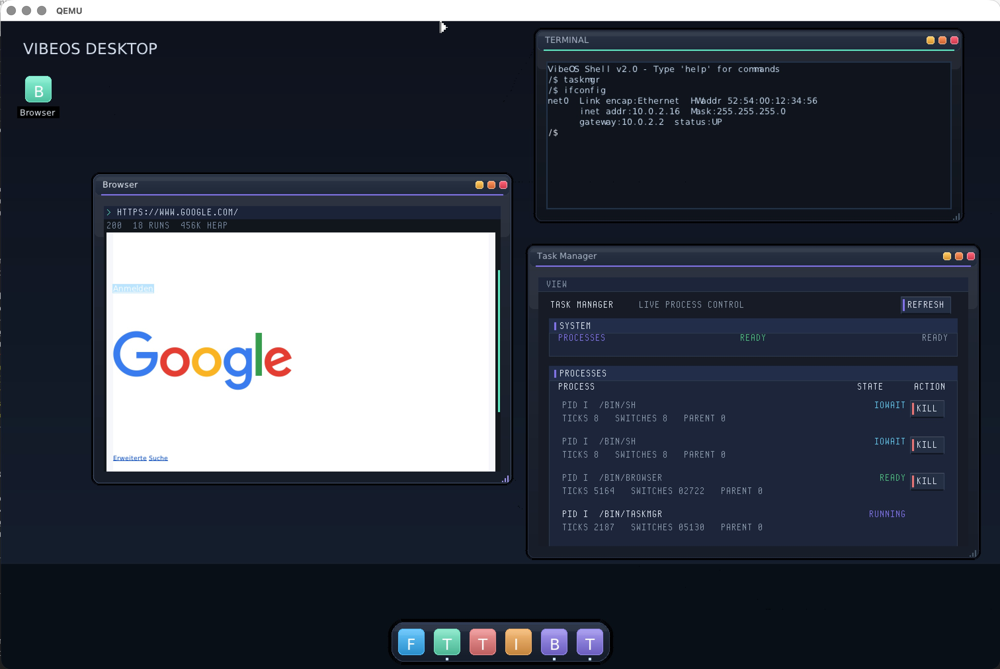

# VibeOS

A hobby x86_64 operating system vibed with AI from scratch in C, C++20 and x86 assembly.
It boots via GRUB/Multiboot2, runs entirely bare-metal, and includes a working graphical desktop, networking stack, persistent ext2 file system, and a userspace with a shell, text editor, browser and GUI apps.



---

## Features

| Area | Details |
|---|---|
| **Boot** | GRUB Multiboot2 → 32-bit protected mode → 64-bit long mode; VGA text-mode fallback during early init |
| **Memory** | Physical frame allocator, 4-level paging, kernel heap (`kmalloc`/`kfree`), per-process page tables with full address-space isolation; **isolated compositor heap** for window buffers; **per-process image heaps** to prevent fragmentation and overlap |
| **Interrupts** | IDT, PIC remapping, IRQ handlers, `int 0x80` syscall interface (39 syscalls) |
| **Scheduler** | Round-robin preemptive multi-process; FPU/SSE context switch per process (`fxsave`/`fxrstor`) so userspace can freely use floats and SSE |
| **Process management** | `SYS_PROCESS_SPAWN` / `SYS_WAITPID` / `SYS_PROCESS_KILL`; per-process file-descriptor table; `SYS_GETARG` argument passing |
| **Storage** | IDE/PIO driver, ramdisk (in-memory block device for early boot), persistent raw disk image |
| **File system** | ext2 read/write; full VFS layer; `open`/`close`/`read`/`write`/`stat`/`readdir`/`chdir`/`getcwd`/`unlink`/`creat`/`mkdir` syscalls; survives reboots |
| **Networking** | Intel e1000 NIC driver; ARP, IPv4, ICMP (`ping`), UDP, DNS, TCP; HTTP (`curl`); TLS via BearSSL (freestanding port) — `SYS_NET_HTTPS_GET` syscall exists and encrypts the connection, but certificate validation is disabled (accept-all, no trust store) and the shell `curl` command currently only uses plain HTTP |
| **Graphics** | BGA (Bochs Graphics Adapter) driver; **tile-based dirty tracking** with **dirty tile merging** for optimized redraws; **Write-Combining (WC)** enabled via **PAT** for fast framebuffer writes; runtime resolution switching via `display <w> <h>`; **black cursor outlines** for high visibility |
| **Window server** | Multi-window compositor; drag, resize, close; **aspect-ratio locked resizing** (`WINSYS_WINDOW_ASPECT_RATIO`); PS/2 mouse + keyboard; **per-window alpha** (glass windows); **dynamic window buffer allocation**; **compositor optimizations** (direct compose + fast opaque blits); **isolated compositor heap** prevents image corruption during heavy allocation |
| **Desktop chrome** | Flat blue-gray glass theme; thin line window controls; **userspace top bar app** (animated SVG hover V-logo, app menu, status indicators, SVG power glyph); floating rounded **dock** with **SVG icons**, **anti-aliased SDF rendering**, **active app status indicators/highlights**, and macOS-style context menu instance switching |
| **Top-bar menu bar** | The focused app declares its menus via `SYS_WINDOW_SET_MENUBAR` / `vos_window_set_menubar` (titles, items, shortcuts, dividers, checkmarks, danger style) or custom VexUI menu sync; the **topbar app** draws the dropdowns and reports picks back as `VOS_EV_MENU_ACTION` |
| **Theming** | Central design-token theme for both kernel chrome and VexUI (`bg`/`surface`/`border`/`text`/`accent`/`ok`/`warn`/`danger`/`menu_*`/`window_alpha`), overridable at runtime from `/home/user/.config/vibeos.theme`; customizable top shadow insets (`shadow_inset_top`) or shadow suppression (`VUI_WINDOW_NO_SHADOW`) |
| **Wallpaper** | Userspace decodes an image (shared `user/libimage`, stb_image) and hands pixels to the kernel via `SYS_SET_WALLPAPER`; `/bin/wallpaper [path]` (default `/wallpapers/default.png`); plain theme-blue backdrop when none set |
| **VexUI toolkit** | Retained-mode widget library: labels, rounded buttons, **pill buttons**, panels, **cards**, **status badges/pills**, **rounded inputs**, **tabs** (accent underline), progress bars, **sparklines**, **dock tiles**; **VBox/HBox layout containers** with `expand`/`fill`/`gap`/`padding`; in-window menu bar; **interactive and styled scrollbars**; **hover delivery to unfocused panels**; **dirty-on-change setters + damaged-rect partial presents** for efficient redraws |
| **Font rendering** | Built-in bitmap font atlas (`font_atlas.c`) used by VexUI and the kernel terminal; DejaVu Sans TTF embedded via `.incbin` + stb_truetype glyph cache (`appfont.c`) used by the browser for anti-aliased proportional text |
| **Userspace libc** | Freestanding libc: stdio/stdlib/string/ctype; `crt0` (entry, `.init_array` ctors, `_exit`); user heap (`umalloc`) |
| **SVG Rendering** | Reusable **lib/svg** library with **anti-aliased SDF (Signed Distance Field) renderer**; used by the dock for high-quality vector icons |
| **C++20 userspace** | Full freestanding C++20 runtime: vtables, RTTI, `typeid`, global/local statics, `new`/`delete`, `__cxa_guard_*`, `__cxa_atexit`; standard headers `<array>`, `<span>`, `<algorithm>`, `<utility>`, `<type_traits>`, `<new>`, `<typeinfo>`, etc. |
| **Kernel C++ runtime** | Kernel-side C++20 subset (no exceptions/RTTI); `new`/`delete` via `kmalloc`; `.init_array` global ctors; automatic boot self-test |
| **Logging** | Kernel event journal (`dmesg`); serial debug output; `SYS_LOG` / `vos_log` for userspace; crash persistence to `/journal.log` |
| **Apps** | `sh` (interactive shell with `audiocfg`), `edit` (text editor), `browser` (revamped with custom **CSS engine**), `taskmgr` (v2 with real-time CPU accounting), `filebrowser` (graphical file manager), `doom` (scalable aspect-ratio locked doomgeneric port), **topbar** (userspace system bar), `uidemo`, `hello`, `cpptest` |

---

## Prerequisites

### macOS

```sh
brew install llvm qemu xorriso
```

Make sure the LLVM tools are on your `PATH` or that `clang`/`clang++`/`ld.lld` from the brew prefix are reachable. The Makefile auto-detects common Homebrew paths.

You also need `grub-mkrescue`. The easiest way on macOS is via a cross-compilation tap:

```sh
brew install --cask mxe   # or use i686-elf-grub from a cross-toolchain
# alternative: build grub from source with --target=x86_64-elf
```

> **Tip:** If `grub-mkrescue` is not in `PATH`, set `GRUB_MKRESCUE=/path/to/grub-mkrescue` when invoking `make`.

### Linux (Debian / Ubuntu)

```sh
sudo apt install clang lld llvm qemu-system-x86 grub-pc-bin xorriso python3
```

### Linux (Arch)

```sh
sudo pacman -S clang lld llvm qemu grub xorriso python
```

### All platforms

- Python 3 is required for `scripts/ext2_put.py` (installs apps onto the disk image).
- `make` (GNU Make).

---

## Building

```sh
# 1. Build the kernel ELF and all userspace apps, create the bootable ISO
make all

# 2. Create the persistent disk image (only needed once)
make disk        # creates vibeos-disk.img (32 MB ext2, survives reboots)

# 3. Install userspace apps onto the disk image
make apps

# 4. Boot in QEMU
make run
```

**All-in-one first build:**

```sh
make all && make disk && make apps && make run
```

On subsequent builds, `make run` is enough — it rebuilds whatever changed.

### Individual targets

| Command | Description |
|---|---|
| `make kernel` | Compile kernel + userspace blobs → `build/vibeos.elf` |
| `make iso` | Wrap ELF in a GRUB ISO → `build/vibeos.iso` |
| `make disk` | Create blank `vibeos-disk.img` (ext2, formatted on first boot) |
| `make apps` | Build all userspace binaries and `ext2_put` them onto the disk |
| `make run` | Boot ISO in QEMU with HVF/KVM acceleration and e1000 networking |
| `make run-serial` | Same, but pipe serial port to stdout (for kernel log) |
| `make run-debug` | Same as `run` but with `-no-shutdown` (QEMU stays open on triple fault) |
| `make clean` | Remove `build/` (disk image and ISO are kept) |

---

## Running

QEMU launches with:
- **256 MB RAM**, `vga std` framebuffer
- **HVF** acceleration on macOS / **KVM** on Linux (falls back to TCG)
- **Intel e1000** NIC with SLIRP user networking (guest IP `10.0.2.15`, DNS at `10.0.2.3`)
- Persistent **IDE disk** backed by `vibeos-disk.img`

The desktop starts automatically. Click the **TERM** icon on the taskbar to open a terminal.

### Shell commands

**File system**
```
ls [path]              list directory
cd <path>              change directory
pwd                    print working directory
cat <file>             print file contents
stat <path>            show file metadata (size, type, inode)
touch <file>           create empty file
mkdir <dir>            create directory
rm <path>              remove file
cp <src> <dst>         copy file
mv <src> <dst>         move / rename
echo <text> [> file]   print text or redirect to file
```

**Network**
```
ping <host/ip>         ICMP ping (e.g. ping 8.8.8.8)
ifconfig / ip          show IP address, MAC, link status
curl <url>             HTTP GET (plain-text only; strips http:// prefix)
```

**System**
```
display <w> <h>        switch screen resolution at runtime (e.g. display 1024 768)
dmesg / journal        print kernel event journal
about                  OS version info
clear                  clear terminal
exit                   exit shell
```

**GUI apps** (launch from shell or desktop icons)
```
gui / desktop / wm     start graphical desktop
taskmgr / tasks        process manager (v2 with live CPU details)
browser / web          HTTP/HTTPS text browser with CSS engine
filebrowser / files    graphical file manager with icons
doom                   aspect-ratio locked scalable doomgeneric game port
edit <file>            text editor
audiocfg               sound levels / audio configuration utility
topbar                 userspace system bar
uidemo                 VexUI widget demo
hello                  minimal hello-world app
cpptest / c++test      C++20 runtime smoke test
```

### Desktop Shortcuts

Desktop shortcuts are managed as small text files with a `.desktop` extension located in `/home/user/Desktop/`.

**Creating a shortcut manually:**

You can create a shortcut using the terminal:

1.  **Ensure the directory exists:**
    ```bash
    mkdir -p /home/user/Desktop
    ```

2.  **Create the shortcut file:**
    ```bash
    echo "Name=Terminal" > /home/user/Desktop/Terminal.desktop
    echo "Exec=/bin/terminal" >> /home/user/Desktop/Terminal.desktop
    echo "IconColor=#64f2cc" >> /home/user/Desktop/Terminal.desktop
    ```

3.  **Refresh:**
    Shortcuts are currently loaded during the startup of the window manager. You may need to restart the system or the window manager to see the changes.

**File format:**
- `Name`: The label displayed below the icon.
- `Exec`: Absolute path to the executable (usually in `/bin/`).
- `IconColor`: Hex code for the icon's background tile.

---

## Project Layout

```
VibeOS/
├── kernel/
│   ├── include/          — kernel headers
│   └── src/              — kernel C/C++ and assembly source
│       ├── boot.S        — Multiboot2 entry, long-mode switch
│       ├── kernel.c      — main kernel init
│       ├── process.c     — scheduler + process management
│       ├── paging.c      — virtual memory / page tables
│       ├── net.c         — networking stack (ARP/IP/ICMP/UDP/TCP)
│       ├── ext2_fs.c     — ext2 file system
│       ├── window.c      — window server
│       ├── cxx_runtime.cpp — kernel-side C++ ABI
│       └── ...
├── user/
│   ├── libc/             — freestanding libc + C++20 runtime + crt0
│   │   └── include/      — standard headers (stdio, stdlib, string, new, …)
│   ├── taskmgr/          — Task Manager (C++20, VexUI)
│   ├── topbar/           — Top Bar (C++20, VexUI, userspace)
│   ├── vexui.c/h         — retained-mode GUI toolkit
│   ├── sh.c              — interactive shell
│   ├── browser.c         — HTTP text browser
│   ├── edit.c            — text editor
│   └── ...
├── lib/
│   └── svg/              — reusable SVG/SDF renderer
├── third_party/
│   ├── bearssl/          — TLS library (freestanding port)
│   └── stb/              — stb_truetype / stb_image
├── boot/grub/grub.cfg    — GRUB menu config
├── linker.ld             — kernel linker script
├── scripts/              — build helper scripts (ext2_put.py, …)
└── Makefile
```

---

## Architecture overview

```
┌─────────────────────────────────────────────────────────┐
│  Userspace (ring 3)                                     │
│  sh  edit  browser  taskmgr  topbar  uidemo  hello      │
│  ↑                                                      │
│  user/libc  (stdio/stdlib/string, crt0, C++20 ABI)      │
│  user/vexui (retained-mode GUI toolkit, VBox/HBox)      │
├─────────────────────────────────────────────────────────┤
│  Kernel (ring 0)                                        │
│  scheduler · paging · heap · VFS · ext2                 │
│  e1000 · ARP/IP/ICMP/UDP/DNS/TCP · BearSSL TLS          │
│  framebuffer renderer · window server · PS/2 input      │
│  IDT · PIC · IRQ · syscall (int 0x80)                   │
├─────────────────────────────────────────────────────────┤
│  GRUB Multiboot2 → 32-bit → 64-bit long mode           │
└─────────────────────────────────────────────────────────┘
        QEMU  ·  x86_64 bare metal
```

---

## Writing a userspace app

A VibeOS app is an ordinary freestanding ELF that starts at `int main()` (the
`crt0` from `user/libc` runs global constructors and calls `_exit` for you).
There are two flavours:

- **CLI app** — reads/writes via the libc (`printf`, `read`, files, sockets).
  Runs in a terminal/shell, no window.
- **GUI app** — opens a window through the **VexUI** toolkit (`user/vexui.h`)
  *or* presents its own pixel buffer directly (like the browser).

All the syscalls are wrapped by the libc in [`user/libc/include/vibeos.h`](user/libc/include/vibeos.h)
(`vos_*`) and [`user/libc/include/sys/syscall.h`](user/libc/include/sys/syscall.h)
(raw `__scN`). GUI helpers live in [`user/vexui.h`](user/vexui.h).

### 1. Minimal CLI app

`user/hello/hello.c`:

```c
#include <stdio.h>

int main(int argc, char *argv[]) {
    printf("Hello from VibeOS!\n");
    if (argc > 1) {
        printf("Arguments passed: %d\n", argc - 1);
        for (int i = 1; i < argc; i++) {
            printf("  argv[%d]: %s\n", i, argv[i]);
        }
    } else {
        printf("No arguments passed.\n");
    }
    return 0;
}
```

### 2. A GUI app with VexUI

VexUI is **retained-mode**: you build a widget tree once, then `vui_run()`
takes over — it polls input, repaints only when something actually changes
(dirty-on-change), and presents just the damaged region. Widgets are positioned
absolutely or arranged by `VBox`/`HBox` containers.

`user/myapp/myapp.cpp`:

```cpp
#include "vexui.h"
#include <vibeos.h>

static vui_widget *g_count;
static int         g_clicks;

static void on_inc(vui_widget *) {
    char buf[32];
    __builtin_snprintf(buf, sizeof buf, "Clicks: %d", ++g_clicks);
    vui_set_text(g_count, buf);          // dirty-on-change: repaints only if changed
}

int main() {
    vui_window *win = vui_window_open("My App", 420, 300);

    // --- top-bar menu bar (shown while this window is focused) ---
    static const vos_menubar_item menu[] = {
        {"App", "", VOS_MB_TITLE, 0},
        {"Increment", "Ctrl+I", 0, 1},
        {"", "", VOS_MB_DIVIDER, 0},
        {"Quit", "Ctrl+Q", VOS_MB_DANGER, 2},
    };
    vui_window_set_menubar(vui_window_id(win), menu,
                           sizeof menu / sizeof menu[0]);

    // --- widgets ---
    vui_card(win, 16, 16, 388, 70, "Counter");
    g_count = vui_label(win, 28, 48, "Clicks: 0");

    vui_widget *btn = vui_button(win, 16, 100, "Increment");
    vui_on_click(btn, on_inc);

    vui_pill_button(win, 150, 100, "Docs");      // rounded tag-style button
    vui_badge(win, 16, 140, "READY");            // status pill (colour via vui_set_color)
    vui_input(win, 16, 170, 388, "Search...");   // rounded text/search field
    vui_bar(win, 16, 210, 388, 8, 100);          // progress bar

    vui_run(win);                                 // never returns
}
```

### VexUI Controls & Widgets Reference

VexUI provides a comprehensive set of Retained-Mode UI controls. Here is a list of all widgets available in `user/vexui.h`:

#### Container & Structural Widgets
* **`vui_panel(w, x, y, width, height, title)`**: A standard container surface with an optional top border and text title.
* **`vui_card(w, x, y, width, height, title)`**: A rounded container card surface with a shaded background (ideal for grouping metrics).
* **`vui_pill(w, x, y, width, height)`**: A large, pill-shaped rounded background plate (used for containers like the desktop dock).

#### Interactive Buttons & Inputs
* **`vui_button(w, x, y, text)`**: A standard clickable button with rounded corners.
* **`vui_pill_button(w, x, y, text)`**: A fully-rounded, capsule-shaped pill button (often used for tags or quick actions).
* **`vui_tile_button(w, x, y, text)`**: A squared, desktop-shortcut style button supporting custom SVG icon overlays.
* **`vui_input(w, x, y, width, placeholder)`**: A rounded text field that accepts keyboard input and handles focused selection.

#### Data Display & Graphics
* **`vui_label(w, x, y, text)`**: Proportional, anti-aliased text labels supporting dynamic scaling (`vui_set_text_scale`).
* **`vui_badge(w, x, y, text)`**: A small status badge pill (color variant determined by setting `vui_set_color` to VUI_OK, VUI_WARN, or VUI_DANGER).
* **`vui_image(w, x, y, size)`**: Renders a raw SVG icon or logo based on custom vectors loaded through `vui_set_icon_svg`.
* **`vui_bar(w, x, y, width, height, max)`**: A horizontal progress bar that fills up to the designated value.
* **`vui_sparkline(w, x, y, width, height)`**: A decorative mini line graph for tracking historical trends.
* **`vui_metric(w, x, y, width, height, title, mode)`**: A composite self-contained KPI widget displaying a title, large highlighted value, sub-label, and historical chart.
* **`vui_tabs(w, x, y, width, labels, active)`**: Tab strip navigation with active accent underline highlighting (e.g., labels `"Home|Files|Settings"`).

#### Custom Rendering (Canvas)
* **`vui_canvas(w, x, y, width, height, pixels)`**: A retained canvas element mapping to an `XRGB` pixel array for custom drawing components.
* **`vui_canvas_ex(w, x, y, width, height, pixels, stride)`**: Extended canvas widget supporting custom stride row lengths for hardware/sub-buffer scaling.

#### Layout Containers
* **`vui_vbox(w, x, y, width, height)`**: Invisible vertical packing box arranging children top-to-bottom.
* **`vui_hbox(w, x, y, width, height)`**: Invisible horizontal packing box arranging children left-to-right.


#### Standard Dialogs
* **`vui_file_dialog(title, path, out_path, cap, mode)`**: Opens a standard file selection dialog (blocking). `mode=0` for Open, `mode=1` for Save As. Returns 1 if a file was selected.

#### Window Configuration & Options (Flags)

When creating a GUI window with VexUI, you can use `vui_window_open_ex` or `vui_window_open_inset` to specify custom behaviors using flags:

```cpp
vui_window *win = vui_window_open_ex("Custom Aspect App", 640, 480, 
                                     VUI_WINDOW_ASPECT_RATIO | VUI_WINDOW_POSITIONED,
                                     100, 100);
```

Available window flags (defined in `user/vexui.h`):

* **`VUI_WINDOW_FRAMELESS`**: Renders the window without standard window chrome (borders/title bar).
* **`VUI_WINDOW_NO_DOCK`**: Prevents the window from minimizing or registering with the dock, maintaining its standard presence.
* **`VUI_WINDOW_POSITIONED`**: Spawns the window at absolute coordinates (`x`, `y`) instead of using cascaded center placement.
* **`VUI_WINDOW_ALWAYS_ON_TOP`**: Keeps the window drawn on top of all normal application windows.
* **`VUI_WINDOW_TRANSLUCENT`**: Enables alpha-translucency for the window background surface.
* **`VUI_WINDOW_NO_SHADOW`**: Disables the drop-shadow rendering under this window (ideal for panel layouts).
* **`VUI_WINDOW_ASPECT_RATIO`**: Locks interactive window resizing by the mouse to maintain its initial aspect ratio.

#### Layout Containers & Scrollbars

* **VBox/HBox Layouts**: Retrieve structured layouts with `vui_vbox` and `vui_hbox`, and pack children inside via `vui_box_add`. Supports custom spacing, gap controls, margins, and dynamic growth properties (`vui_set_expand`, `vui_set_gap`, `vui_set_padding`).
* **Interactive Scrollbars**: VexUI automatically renders and updates interactive scrollbars for scrolls or views containing content overflow, allowing smooth vertical/horizontal panning of large widget panels or browser windows.


### 3. App-defined top-bar menus

The global top bar shows the **focused** window's menu bar. Declare it once with
`vui_window_set_menubar(id, items, count)`. The list is flat: an item flagged
`VOS_MB_TITLE` opens a new top-level menu, the items after it are its entries.
Flags: `VOS_MB_DIVIDER`, `VOS_MB_DANGER`, `VOS_MB_CHECK` / `VOS_MB_CHECKED`,
`VOS_MB_ARROW`. When the user picks an entry the app receives a
`VOS_EV_MENU_ACTION` event whose `key` is the item's `action_id` — handle it in
a custom event loop, or (with VexUI's in-window menu) via `vui_on_click`.

### 4. Theming

Colours come from a central theme (design tokens), not hardcoded values, so apps
inherit the system look automatically. A theme file at
`/home/user/.config/vibeos.theme` overrides both the kernel chrome and VexUI at
runtime:

```
accent=4DA3FF
surface=1B3048
menu_bg=0C1B2A
window_alpha=234      # 0-255; <255 makes app windows glassy
```

### 5. Drawing your own pixels (custom canvas)

Apps requiring low-level pixel control (like browsers or game engines) bypass the VexUI widget tree and present a raw `0x00RRGGBB` pixel buffer directly to the window compositor.

Here is a complete, working demo application showing how to create a custom canvas window, handle mouse dragging to draw strokes, and clear the screen using key input:

```c
#include <vibeos.h>
#include <string.h>

#define WIDTH  640
#define HEIGHT 480

static uint32_t s_fb[WIDTH * HEIGHT];
static int s_mouse_x = -1;
static int s_mouse_y = -1;
static int s_mouse_down = 0;

static void draw_rect(int rx, int ry, int rw, int rh, uint32_t color) {
    // 1. Clamp bounds once outside the loop to avoid inner branch checks
    int y_start = ry < 0 ? 0 : ry;
    int y_end = ry + rh > HEIGHT ? HEIGHT : ry + rh;
    int x_start = rx < 0 ? 0 : rx;
    int x_end = rx + rw > WIDTH ? WIDTH : rx + rw;

    if (x_start >= x_end || y_start >= y_end) return;

    // 2. Linear inner loop allows compiler to optimize/vectorize writes
    for (int y = y_start; y < y_end; ++y) {
        uint32_t *row = &s_fb[y * WIDTH + x_start];
        int count = x_end - x_start;
        for (int x = 0; x < count; ++x) {
            row[x] = color;
        }
    }
}

int main(void) {
    // 1. Open a raw window
    int win_id = vos_window_create("Canvas Demo", WIDTH, HEIGHT);
    if (win_id < 0) return 1;

    // Clear background to dark blue
    draw_rect(0, 0, WIDTH, HEIGHT, 0x000F172A);

    int running = 1;
    while (running) {
        struct vos_event ev;
        
        // 2. Poll inputs, resize bounds, or window close requests
        while (vos_event_poll(win_id, &ev) == 1) {
            switch (ev.type) {
                case VOS_EV_CLOSE:
                    running = 0;
                    break;
                case VOS_EV_MOUSE_DOWN:
                    s_mouse_down = 1;
                    s_mouse_x = ev.x;
                    s_mouse_y = ev.y;
                    break;
                case VOS_EV_MOUSE_UP:
                    s_mouse_down = 0;
                    break;
                case VOS_EV_MOUSE_MOVE:
                    s_mouse_x = ev.x;
                    s_mouse_y = ev.y;
                    break;
                case VOS_EV_KEY:
                    if (ev.key == 'c' || ev.key == 'C') {
                        // Clear canvas on pressing 'c'
                        draw_rect(0, 0, WIDTH, HEIGHT, 0x000F172A);
                    }
                    break;
            }
        }

        // 3. Perform custom rendering calculations (e.g. draw under mouse pointer)
        if (s_mouse_down && s_mouse_x >= 0 && s_mouse_y >= 0) {
            draw_rect(s_mouse_x - 4, s_mouse_y - 4, 8, 8, 0x0038BDF8); // draw sky-400 marker
        }

        // 4. Present the updated framebuffer to the window compositor.
        // Use vos_window_present_rect to present only modified coordinates if optimizing.
        vos_window_present(win_id, s_fb, WIDTH, HEIGHT);

        // Throttle updates (sleep for 2 ticks, approx 50-60 FPS)
        vos_sleep_ticks(2); 
    }

    return 0;
}
```

> [!TIP]
> **Performance Note**: The optimized `draw_rect` version above clamps rendering bounds *outside* the loop. This completely removes branch checks (`if` statements) from the inner loop, allowing compilers (`clang`/`gcc` with `-O2` or `-O3`) to fully vectorize the drawing operation using SIMD instructions, resulting in a dramatic speedup.

### 6. Wiring it into the build

Add to the `apps:` target in the [`Makefile`](Makefile):

```makefile
$(CXX) $(UCXXFLAGS) $(LIBC_INC) -Iuser -c user/myapp/myapp.cpp -o build/user/myapp.o
$(LD) -nostdlib -static -T user/linker.ld -o build/user/myapp.elf \
    $(LIBC_CRT0) build/user/myapp.o build/user/vexui.o $(LIBC_A)
$(USTRIP) --strip-all build/user/myapp.elf
python3 scripts/ext2_put.py $(DISK_IMG) build/user/myapp.elf /bin/myapp
```

(A CLI app drops `build/user/vexui.o`. To bundle assets, `ext2_put.py` also
creates any missing parent directories, e.g. `/wallpapers/default.png`.)

Then:

```bash
make apps          # compile + install ALL apps onto the disk image
make run           # boot; type `gui` for the desktop, then `myapp` (or launch from the dock)
```

`make apps` installs to the persistent disk image, so a plain `make run` picks up
the new app without rebuilding the ISO.

### Compiling a single app

`make apps` rebuilds every app. To iterate on just one, run that app's three
steps directly (compile → link → install). The toolchain variables come from the
Makefile: `$(CXX)`/`$(CC)`, `$(UCXXFLAGS)`/`$(UCFLAGS)`, `$(LIBC_INC)`,
`$(LIBC_CRT0)`, `$(LIBC_A)`, `$(USTRIP)`, `$(DISK_IMG)`.

```bash
# C++ GUI app (links VexUI + libc):
clang++ -target x86_64-none-elf -ffreestanding -fno-stack-protector -fno-pie \
    -mno-red-zone -mcmodel=small -fno-builtin -Wall -Wextra -std=c++20 -O2 \
    -fno-exceptions -Iuser/libc/include -Iuser \
    -c user/myapp/myapp.cpp -o build/user/myapp.o
ld.lld -nostdlib -static -T user/linker.ld -o build/user/myapp.elf \
    build/user/libc/crt0.o build/user/myapp.o build/user/vexui.o build/user/libc.a
llvm-strip --strip-all build/user/myapp.elf
python3 scripts/ext2_put.py vibeos-disk.img build/user/myapp.elf /bin/myapp
```

This reuses the already-built `build/user/vexui.o` and `build/user/libc.a`; if you changed the toolkit or libc, run `make libc` (and `make apps` once) first. For a CLI C app drop `build/user/vexui.o` and use `clang`/`-std=c11`. 

#### Writing Assets & Binaries with `ext2_put.py`

To copy binaries or assets onto the persistent ext2 disk image (`vibeos-disk.img`) without rebuilding the entire system, run the Python helper script `scripts/ext2_put.py`:

```bash
python3 scripts/ext2_put.py <disk_image> <host_source_path> <guest_destination_path>
```

**Common Examples:**
* **Copy an app binary**:
  ```bash
  python3 scripts/ext2_put.py vibeos-disk.img build/user/myapp.elf /bin/myapp
  ```
* **Copy a custom wallpaper**:
  ```bash
  python3 scripts/ext2_put.py vibeos-disk.img assets/wallpapers/mybg.png /wallpapers/mybg.png
  ```
* **Copy a custom theme profile**:
  ```bash
  python3 scripts/ext2_put.py vibeos-disk.img mytheme.theme /home/user/.config/vibeos.theme
  ```

*Note: The script automatically creates any missing parent folders on the virtual filesystem (like `/home/user/.config/` or `/wallpapers/`). After copying, simply start the emulator with `make run` to load the updated content.*

> The built-in shell/editor (`sh`, `edit`) are different: they are embedded into
> the kernel image as blobs, so changing them needs `make kernel` (which runs the
> `user` target), not `make apps`.

---

## License

This project is experimental / educational. No license is attached; all rights reserved by the authors.
